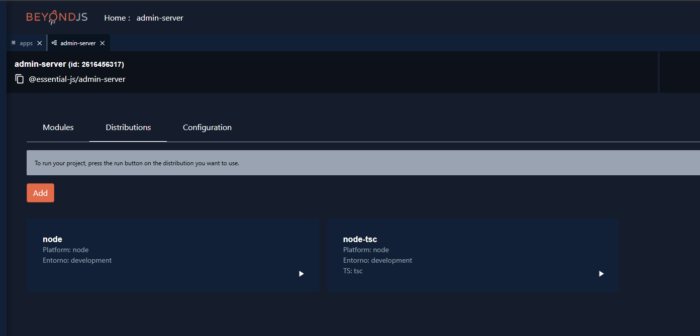

# Essential Administrator

## Introduction

Welcome to the Essential Administrator repository! This project serves as a
foundational template for building custom administration panels tailored to
specific business needs. It encapsulates the core functionalities typically
required for an administrator, making it an ideal starting point for developers
looking to deploy bespoke management systems.

**Note:** This project is under active development, and new features and
improvements are continuously being added.

## Key Features

This template comes equipped with a variety of features that are essential for
any robust administrative system:

-   **User Management**: Supports basic operations such as creating, editing,
    deleting, and listing users.
-   **Profile Management**: Manage user profiles, including assigning different
    roles and permissions.
-   **Permission Handling**: Granular control over what users can see and do
    within the admin panel.
-   **Notification System**: A flexible notification system that allows for
    scheduled and instant notifications to be sent to users or groups of users.
-   **Authentication**: Secure login and authentication processes.
-   **Dashboard Customization**: Users can customize their dashboard view to
    include widgets and features relevant to their roles.

## Technologies

This template is built using modern technologies and frameworks to ensure high
performance and scalability:

-   **Frontend**: React
-   **Backend**: Node.js with Express
-   **Database**: Configured for integration with most relational database
    management systems.
-   **Other Tools**: BeyondJS as a meta framework.

## Getting Started

To get started with this template, clone the repository and follow the setup
instructions below:

```bash
git clone https://github.com/veD-tnayrB/administrator.git

cd administrator
```

```bash
# Install dependencies
cd client
yarn
cd ..
```

```bash
cd server
npm i
cd ..
```

```bash
# Install beyond
npm i -g beyond
```

```bash
# Run the application
beyond run
```

### Setting the environment

To set the server credentials you need to go to `server` and based on the
`.env.example` file create a .env file with your own credentials and thats it

To set the client credentials u need to based on the
`client/firebase-messaging-sw-example.js` file create your own
`firebase-messaging-sw.js` based on that structure with u own credentials, this
is for the service worker of firebase so the notifications works

And go to `client/modules/serverless-provider-setup/serverless-provider-setup/`
check the `firebase-credentials-example.ts` file and create your
`firebase-credentials.ts` file with the same structure but with your own
credentials

and you are ready

Then go to `http://localhost:6550/`

## Firebase Setup

This section explains how to generate Firebase credentials and set up Firebase
for your project.

[Link to Firebase Console](https://console.firebase.google.com/)

### Step 1: Create a Firebase Project

-   Go to the Firebase Console.
-   Sign in with your Google account if you haven't already.
-   Click on Add Project or Create a project.
-   Follow the on-screen instructions to name your project and accept the
    Firebase terms.
-   Once the project is created, you'll be redirected to the Firebase dashboard.

### Step 2: Enable Firebase Services

-   In your Firebase dashboard, select the Project Settings by clicking the gear
    icon next to your project name.
-   Navigate to the General tab.
-   Scroll down to the **"Your Apps"** section, and click Add App.
-   Choose your platform (Web) and follow the instructions to register your app.

### Step 3: Download Firebase Credentials (Service Account)

-   From the Firebase console, click the gear icon next to Project Overview and
    select Project Settings.
-   Navigate to the Service accounts tab.
-   Click Generate New Private Key under the Firebase Admin SDK section.
-   A .json file will be downloaded to your computer. This file contains your
    Firebase credentials.
-   Note: Keep this file secure, as it contains sensitive information about your
    project.

### Step 4: Add Firebase Credentials to Your Project

-   Copy the downloaded serviceAccountKey.json file to your project directory.

## Import Database

To set up the database for this project, follow the steps below:

Navigate to the `/docs/db.sql` file in the project directory. This file contains
the SQL script necessary to initialize the database.

## Note:

### Start Admin Server

Once the workspace is set up and the database is imported, you can start the
admin-server service:



## Customization

To customize this template for your own use:

1. Fork this repository.
2. Clone your forked repository.
3. Modify or extend the existing functionalities to suit the specific
   requirements of your client or project.
4. Deploy your custom administrator panel.

## Contribution

Contributions to this template are welcome. If you have suggestions for
improvements or have identified bugs, please open an issue or submit a pull
request.

## License

This project is licensed under the MIT License - see the [LICENSE](LICENSE) file
for details.

## Disclaimer

This template is provided as-is, and while it is extensively tested and
maintained, the maintainers of this repository are not responsible for any
issues that arise from its use.

Thank you for considering the Essential Administrator for your next project!
